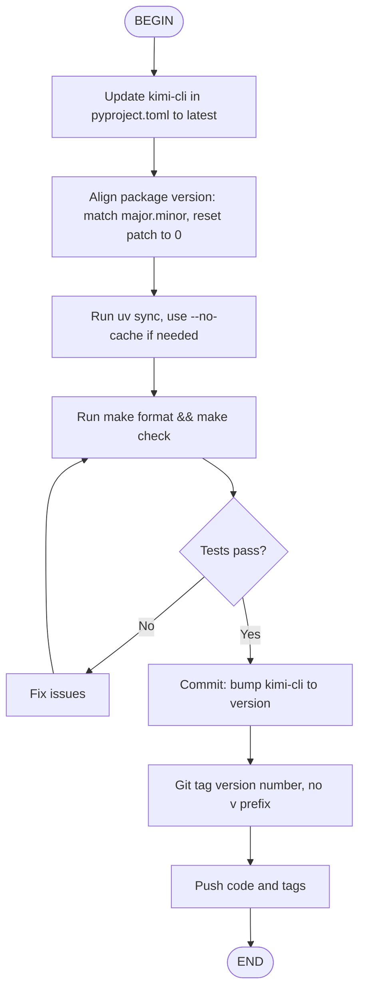

> This post is first published as a [X article](https://x.com/xiaoxxchan/status/2011825791408226618?s=20)


People are getting creative (or crazy) with agents.

**Prompt as script:**

```bash
cat PROMPT.md | <agent>
```

Commit prompts to repos. Reusable, version-controlled.\
Like AGENTS.md, but executable.\
Translate docs. Sync docs from code. Generate changelog. Create PR.

**Ralph Loop:**

```bash
while :; do cat PROMPT.md | <agent>; done
```

Keep trying until it works. Persistence as a feature.
Geoffrey Huntley named it after Ralph Wiggum - "dim-witted but relentlessly optimistic and undeterred." ([VentureBeat](https://venturebeat.com/technology/how-ralph-wiggum-went-from-the-simpsons-to-the-biggest-name-in-ai-right-now))

Simple techniques that just work. And they seem to share something.

---

Meanwhile, the eternal debate: agents vs workflows.

You want flexibility. You also want reliability.
[@beyang](https://x.com/beyang/status/2011131386355466494?s=20) on Ralph: "you hit a wall where code spaghettifies."

So people reach for workflow engines. DAGs. Orchestration.
But that's infrastructure, not prompting. A different beast.
Too much structure. Too heavy a mindset.
Most importantly, not fun any more.

Or they babysit the agent. Approve every step. Never let go.
Too much control. Doesn't scale.

We're equipping agents with skills, but there's still a gap before full-blown workflows.

What if there's something in the middle?
Between chaos and order.
Structure and freedom.

> The world is jumping between agentic logics and deterministic > workflows, a perpetual dance. 
> 
> Reminds me of this famous I Ching quote - 
> 
> 天行健，君子以 agentic   不息
> 地势坤，君子以 dag flow 载物
> 
> -- [@Eric Xu](https://x.com/xleaps/status/2011647472603443361?s=20)

---

Remember learning algorithms? You drew flowcharts first, then translated to code.
Decision diamonds. Process boxes. Arrows.

What if we just use flowcharts to prompt agents?

Imagine: you send one instruction, wait for the agent to finish, then send the next. You're the state machine - tracking where you are, deciding which branch to take.

We can automate that. An interpreter that walks the flowchart, feeds each node to the agent, and moves on.

Or, you could send the entire flowchart to the agent and let it execute in its head. Both work. The first is more reliable. The second is simpler.

A real example - release workflow:




Not too different from writing 1. 2. 3. steps.
D2-style is even cleaner:

```d2
A: BEGIN
B: Update kimi-cli in pyproject.toml to latest
C: "Align package version: match major.minor, reset patch to 0"
D: "Run uv sync, use --no-cache if needed"
E: Run make format && make check
F: Tests pass? { shape: diamond }
G: Fix issues
H: "Commit: bump kimi-cli to version"
I: "Git tag version number, no v prefix"
J: Push code and tags
K: END

A -> B -> C -> D -> E -> F
F -> G: No
G -> E
F -> H: Yes
H -> I -> J -> K
```

Each node = one instruction in natural language. One agent turn.
The agent executes, chooses branches, loops when needed.

That's **Prompt Flow** - the interpreter that walks the flowchart for you.

- Human and LLM readable
- Paste anywhere = instant visualization. WYSIWYG.
- No new syntax. Existing formats, new meaning.
- Ask an LLM to generate one for you.

---
It works above the agent loop.
No special model support. Just a more structured way to prompt.

You're not building a graph of function calls, LLM calls, or agent nodes.
You're writing instructions - with structure.

---

Prompt Flow feels like a nice form of "natural language programming."

We dream: in the era of coding agents, natural language compiles to code.
The endgame is declarative - just describe what you want, and it happens.

We're not there yet.

Prompt Flow is procedural - step by step, with explicit branches and loops.
It's a stepping stone. Guardrails for today's models.

Like instructions in system prompts - delete them when models get smarter.

---

**What's next:**

Prompt Flow inside Skills. Skills become reliable workflows.
What else? We'd love to hear your ideas.
---

Prompt Flow now lives in Kimi CLI. Give it a try and let us know what you think.

BTW, Kimi CLI supports all major LLM providers - not just Kimi. Though K2 Thinking is definitely worth a spin.

https://moonshotai.github.io/kimi-cli/
